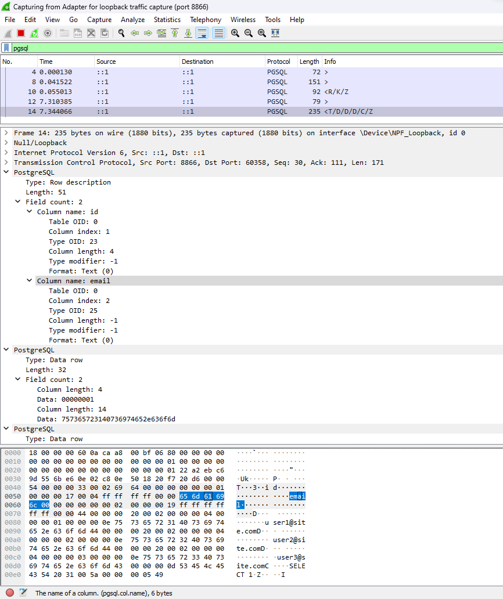

# PgProtoKt - A framework for building Postgres Wire-Protocol backends on the JVM

This library takes care of the difficult work of managing binary serialization/de-serialization and networking
protocols, so that you can focus on implementing business logic.

The goal is to allow users to write new Postgres wire-protocol compatible services with minimum effort, while keeping
the codebase as simple as possible.

## Example

Below is a working example of an interface implementation that can successfully be connected to with `psql` (or any
other client), complete the initial startup + authentication handshake, and then can query the fake in-memory DB using a SQL parser library:

```java
public class FakeInMemoryDB {
    public static Map<String, List<Map<String, Object>>> TABLES = new HashMap<>();

    static {
        TABLES.put("users", List.of(
                Map.of("id", 1, "name", "John", "age", 30),
                Map.of("id", 2, "name", "Jane", "age", 25),
                Map.of("id", 3, "name", "Joe", "age", 20)
        ));

        TABLES.put("posts", List.of(
                Map.of("id", 1, "title", "Post 1", "user_id", 1),
                Map.of("id", 2, "title", "Post 2", "user_id", 2),
                Map.of("id", 3, "title", "Post 3", "user_id", 3)
        ));
    }

    private FakeInMemoryDB() {
    }
}

public class ExamplePostgresFrontendMessageHandler implements IPostgresFrontendMessageHandler {

    private static final Logger logger = LogManager.getLogger(ExamplePostgresFrontendMessageHandler.class);

    @Override
    public void handleSSLRequest(final ChannelHandlerContext ctx, final FrontendBootstrapMessage.SSLRequest msg) {
        try (final Buffer buf = ctx.bufferAllocator().allocate(1)) {
            buf.writeByte((byte) 'N');
            ctx.writeAndFlush(buf);
        }
    }

    @Override
    public void handleStartup(final ChannelHandlerContext ctx, final FrontendBootstrapMessage.Startup msg) {
        ctx.write(new BackendMessage.AuthenticationOk());
        ctx.write(new BackendMessage.BackendKeyData(1, 2));
        ctx.write(new BackendMessage.ReadyForQuery(TransactionStatus.IDLE));
        ctx.flush();
    }

    @Override
    public void handleQuery(ChannelHandlerContext ctx, FrontendCommandMessage.Query msg) {
        try {
            Statement stmt = CCJSqlParserUtil.parse(msg.query());

            if (stmt instanceof Select select) {
                List<String> tableList = new TablesNamesFinder().getTableList(select);
                String tableName = tableList.get(0);

                Map<String, String> columnMap = new HashMap<>();
                ((PlainSelect) select.getSelectBody()).getSelectItems().forEach(item -> {
                    item.accept(new SelectItemVisitorAdapter() {
                        @Override
                        public void visit(SelectExpressionItem item) {
                            Column column = (Column) item.getExpression();
                            columnMap.put(item.getAlias() != null
                                            ? item.getAlias().getName()
                                            : column.getColumnName(),
                                    column.getColumnName());
                        }
                    });
                });

                List<Map<String, Object>> rows = FakeInMemoryDB.TABLES.get(tableName).stream()
                        .map(row -> {
                            Map<String, Object> rowMap = new HashMap<>();
                            row.forEach((key, value) -> rowMap.put(columnMap.get(key), value));
                            return rowMap;
                        })
                        .toList();

                BackendMessage.RowDescription rowDescription = new BackendMessage.RowDescription(
                        columnMap.keySet().stream().map(expression -> BackendMessageFieldBuilder.builder()
                                .name(expression)
                                .tableOid(0)
                                .tableColumn(0)
                                .dataTypeOid(25)
                                .dataTypeModifier(-1)
                                .dataTypeSize(-1)
                                .formatCode(0)
                                .build()).toList());
                ctx.write(rowDescription);

                rows.forEach(row -> {
                    BackendMessage.DataRow dataRow = new BackendMessage.DataRow(row.values());
                    ctx.write(dataRow);
                });

                ctx.write(new BackendMessage.CommandComplete(1, CommandType.SELECT));
                ctx.write(new BackendMessage.ReadyForQuery(TransactionStatus.IDLE));
                ctx.flush();
            } else {
                throw new IllegalStateException("Unexpected value: " + stmt);
            }
        } catch (JSQLParserException e) {
            throw new RuntimeException(e);
        }
    }
}

```

# Demo Video with `psql`

https://user-images.githubusercontent.com/26604994/164947222-26dbbd75-ba2d-4c1b-b893-cf0b2a271554.mp4

# Wireshark Payload




